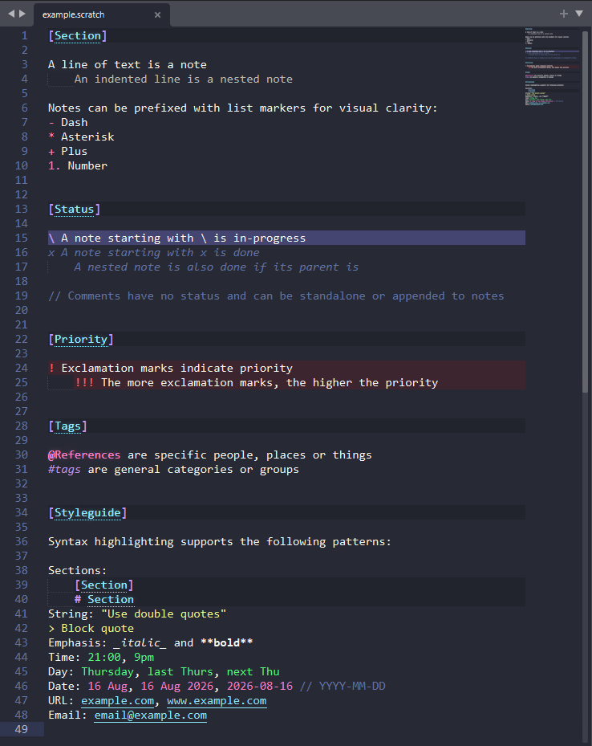

# scratchpad.txt

scratchpad.txt is a plain-text format for quickly capturing and processing notes and tasks. It is inspired by [todo.txt](https://github.com/todotxt/todo.txt), with some modifications for purpose and taste.

While designed to be readable as plain text, scratchpad.txt is intended for use with the accompanying [Sublime Text](https://www.sublimetext.com) syntax.

Save files with a `.scratch` file extension for Sublime Text to automatically detect the syntax.



## Installation

1. In Sublime Text go to `Preferences → Browse Packages`
2. Open the `User` folder
3. Move the `scratchpad.txt` folder inside
4. Open a `.scratch` file, or manually set the syntax to `scratchpad.txt`
5. With a corresponding color scheme active, highlighting will apply automatically

### Customisation

The following are syntax settings that improve using the scratchpad.txt syntax.

1. With the `scratchpad.txt` syntax active, go to `Preferences → Settings — Syntax Specific` and paste the following:

```json
{
	"gutter": true,
	"margin": 4,

	"spell_check": true,

	"trim_trailing_white_space_on_save": "not_on_caret",
	"trim_only_modified_white_space": false,
	"ensure_newline_at_eof_on_save": true,
}
```

## Example file

```
[Section]

A line of text is a note
	An indented line is a nested note

Notes can be prefixed with list markers for visual clarity:
- Dash
* Asterisk
+ Plus
1. Number


[Status]

\ A note starting with \ is in-progress
x A note starting with x is done
	A nested note is also done if its parent is

// Comments have no status and can be standalone or appended to notes


[Priority]

! Exclamation marks indicate priority
	!!! The more exclamation marks, the higher the priority


[Tags]

@References are specific people, places or things
#tags are general categories or groups


[Styleguide]

Syntax highlighting supports the following patterns:

Sections:
	[Section]
	# Section
String: "Use double quotes"
> Block quote
Emphasis: _italic_ and **bold**
Time: 21:00, 9pm
Day: Thursday, last Thurs, next Thu
Date: 16 Aug, 16 Aug 2026, 2026-08-16 // YYYY-MM-DD
URL: example.com, www.example.com
Email: email@example.com
```
